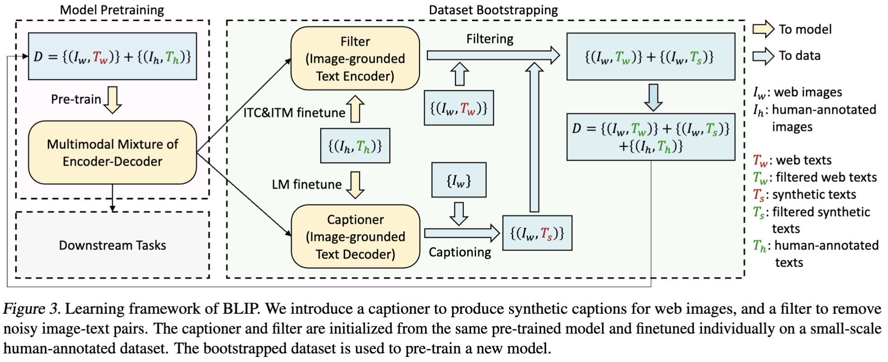

# Multi-Modal 浅学

[toc]

## 1. CLIP (Learning Transferable Visual Models From Natural Language Supervision)

### 1.1 CLIP 模型结构

 

### 1.2 基本原理
#### 图（1）
 CLIP是OPENAI的一个工作，数据集是从网络上爬取的4亿个**图像-文本对**，每一对图像文本都是对应关系，文本描述图像内容，但是由于是网络爬取，所以对应关系可能比较弱。

 在结构图中，文本和图像分别编码，文本编码器Text Encoder 类似BERT，图像编码器Image Encoder类似ViT，每批次为**3万对**图像文本。将文本和图像分别映射为向量
 $T_{i}$和 $I_{i}$，（$i=1,2,...N$）图像向量I和文本向量T都是**768维**的，即N=768.

然后将向量$I$ 和 向量$T$做向量乘得到一个**N\*N的矩阵**.实际上，在这个NN矩阵中，矩阵中的每个数值都是代表**相似度**，代表文字与图像的相似度得分，所以叫这个矩阵叫**相似度矩阵**，实际上在矩阵的**对角线处 $T_x \cdot  I_x$ 才是正样本**，是文本图像对应的地方的相似度得分，其余的部分都可以视作负样本。

因此将这个相似度矩阵的对角线部分视作1，作为正样本，其余部分为0，视作负样本充当训练标签。在训练过程中以BP方式不断迭代，优化Image Encoder 和Text Encoder

**核心思想：**通过海量的弱监督文本，进行**对比学习**，将图片和文本的编码向量在空间上对齐。

思考：在一个批次中有3万张图片文本对，同时进行编码，编码流程是怎样的？编码结果是什么？了解一下ViT编码向量的结果

#### 图（2）（3）
对于文本和图像的编码，可以实现“**文本搜文本”，“图像搜文本”，“文本搜图像”，“图像搜图像”**。即每个搜索任务都会给出搜索对象与被搜索数据的相似度，然后输出相似度排序，可以根据需求选取特定相似度的搜索结果。

## 2. BLIP (Bootstrapping Language-Image Pre-training for Unified Vision-Language Understanding and Generation)
### 2.1 BLIP 模型结构
 
 BLIP的预训练模型架构和目标（相同参数具有相同的颜色）。我们提出了一种多模态混合编码器-解码器，这是一个统一的视觉-语言模型，可以**以三种功能之一**运行：(1) 单模态编码器使用图像-文本对比（ITC）损失进行训练，以对齐视觉和语言表示。(2) 图像引导的文本编码器使用额外的交叉注意力层来模拟视觉-语言交互，并使用图像-文本匹配（ITM）损失进行训练，以区分正负图像-文本对。(3) 图像引导的文本解码器用因果自注意力层替换了双向自注意力层，并与编码器共享相同的交叉注意力层和前馈网络。解码器使用语言建模（LM）损失进行训练，以根据图像生成字幕。

BLIP贡献1：**自然语言理解与自然语言生成任务融合**的开创性工作，用一个模型实现了图像理解（给出一张图片可以生成对应的描述文本）

### 2.2 基本原理
自左向右，一共三个任务ITC，ITM，LM

#### 2.2.1 ITC
image encoder 是一个类似ViT编码器的结构，将输入图像编码输出是一个图像的向量（图中浅紫色方块）
Text Encoder是一个类似**BERT（Bidirectional Encoder Representations from Transformers**)的文本编码器，Bi Self-Att 就是BERT模型中的 双向自注意力机制.此模块会生成一个文本向量（图中浅蓝色方块）
将上述两个向量输入到ITC（Image-Text Constrastive）中，实现图像文本对比学习，实现图像特征和文本特征的对齐。

#### 2.2.2 Image-grounded Text Encoder （ITM）
这里激活了Cross Attention 模块接收Image Enoder的图像向量输出，将文本向量与图像向量结合，输入到ITM（Image-Text Matching）任务中，实际上是一个**二分类任务**，输出**是**或**否**来确定图像文本是否匹配。

#### 2.2.3 Image Encoder （LM）
 
这里激活了Cross Attention 模块接收Image Enoder的图像向量输出，但是与上一个ITM不同的是这里使用**Causul Self-Attention**（因果推断自注意力）来编码文本，是一个生成式模型（类似GPT），可以实现根据图像生成字幕即对应的图像解释。原理就是在训练过程中使用因果掩码（Causul mask）来让模型在训练的过程中无法看到未来的token，从而实现生成式的模型输出结果。

### 2.3 BLIP的训练算法 （Bootstrapping）
 
BLIP贡献2：**弱监督图文清洗**，通过训练模型**剔除了**图文匹配度差的图片文字组，同时对部分图片**生成了更好的**文本标注。
图中I表示Image，T表示Text，角标W表示web即从网络上爬取的图文数据，角标h表示Human即人工标注的正确的图文数据。

从左向右描述训练过程：
首先网络爬取数据和人工标注数据构成的数据集D输入BLIP中执行**预训练（Pre-train**），然后再使用人工标注数据进行**微调（Fine-tune**），进一步提升模型的任务适用性能。根据2.2节的描述，我们会得到**三个模型：文本图像对齐模型ITC，文本图像匹配模型ITM和图像理解文本生成模型LM**。

由于网络爬取的模型会出现弱监督图文匹配度差的问题，模型在后面对数据进行了筛选。流程如下：首先ITC和ITM执行图像文本对齐和匹配问题，即二分类判断，判断$I_w$ 和 $T_w$ 是否匹配，如果匹配则加入新数据集，如果不匹配则去除。同时将
$I_w$ 输入 LM 生成新的图像字幕，将我们的LM新生成的 $T_S$ 和 对应的$I_w$ 同样输入ITC和ITM中判断图文是否匹配，如果匹配则加入到新的数据集，否则丢弃。迭代上述过程N次，会得到越来越精准的图文匹配数据库。

## 3. BLIP2 (Bootstrapping Language-Image Pre-training with Frozen Image Encoders and Large Language Models)
- 改变Query，让LLM认识Query。不用训练LLM，不用让LLM认识新的Query，从而大大降低模型训练成本
### 3.1 BLIP2结构图
 

从图中可以看出BLIP分为两个模块，一个是Vision-and-language representation learning **视觉语言表示学习**和Vision-tolanguage generative learning **视觉语言生成模型**
其中Image Encoder 和 LLM都是**冻结的**，训练模型时**只需要训练Q-Former**即可

### 3.2 阶段1-视觉语言表示学习(Q-Former)
 

### 3.3 阶段2-视觉语言生成模型
 

BLIP2的一大贡献就是，Qformer的提出，在大模型参数冻结的情况下**只需要训练QFormer**，使得需要训练的模型参数大大减少。
效果展示：
 

 ## 4. InstructBLIP (Towards General-purpose Vision-Language Models with Instruction Tuning)
### 4.1 指令数据集
为了确保指令微调数据的多样性，作者收集了来自11种不同任务的26个数据集，并将它们转换为指令调优格式。
 

### 4.2 InstructBLIP结构

增加了**指令字段（instruction**）instruction不仅会指导LLM生成文本，同时也会指导image encoder**提取不同的视觉特征**。这样的好处在于对于同一张图片，根据不同的instruction，我们可以得到**基于instruction偏好更强的视觉特征**，同时对于两个不一样的图片，基于instruction内嵌的通用知识，可以使得模型有更好的知识迁移效果。

 
其余部分与BLIP2基本一致

## 5.ContextBLIP(Doubly Contextual Alignment for Contrastive ImageRetrieval from Linguistically Complex Descriptions)
- ContextBLIP是被设计解决IRCD（Image Retrieval Contextual Description）问题，即在更复杂的语言描述下检索图片
### IRCD任务面临的两个挑战
- 1. 理解细微的文本线索
     例如“手是模糊的”、“眼睛几乎是闭着的”和“看着……”，跨越三个语法复杂的句子，并将它们与各种图片中的线索进行上下文对齐

- 2. 捕获候选图像之间的远程依赖关系
     捕获候选图像之间的远程依赖关系，以执行跨模态推理的进一步对齐。

### 5.1 ContextBLIP模型结构
 

 ContextBLIP包含三个关键成分：
 第一个是编码器：Intra-context Encoder，在BLIP的基础上增加了多尺度适配器（上采样下采样适配器，U/DPAL）,用于**提取细微**的特征。

 第二个是ITM（Image Text matching， $ L_{ITM} $ ）损失

 第三个是TMIM（Text-guided Mask Image Model, $  L_{TMIM}  $ ）

 ### 5.1 Intra-context Encoder
 图中(b)即是模型的编码器，就是在vanilla BLIP （基础版BLIP）的结构基础上，插入了适配器（紫色块），BLIP的参数是冻结的

 在ViT各个层之间的下采样适配器DPAL其实就是一个MLP多层感知机，公式如下：
$$
\hat{X}^l = DPAL(X^l)
$$
这里，DPAl就是一个MLP，$ \hat{X}^l  \in \mathbb{R}^{p^2 \times \hat{d}}$. $l$ 表示在ViT的第$l$层，$p$是ViT中的image 被分成$p \times p$中的p，d表示ViT的表示维度，$\hat{d} = d/{\Delta}$, $\Delta$表示下采样率，在所有的DPAl中 $\Delta$ 相同，在每一层获得的表示只需要简单相加和concat就可以了。将所有层的 $ \hat{X}^l$ 加起来得到 $ X^l $,输入到上采样适配器UPDL，UPDL也是类似的MLP结构
$$
Y = UPAL(X^l)
$$
将输出Y与ViT的输出相加得到图像的最终表示。然后文本表示使用BERT模型，将BERT输出的文本表示和图像编码器的最终输出一起输入到Fusion Layer得到ContextBLIP Encoder 的最终表示

### 5.2 两个损失函数联合监督

$L_{ITM}$ 和 $L{TMIM}$ 执行协作监督训练适配器。

$L_{ITM}$是计算图像和文本的匹配程度得分的过程中的得分。模型会计算输入文本与多个候选图像的相似度得分通过区分更多相似的候选图像，我们的ContextBLIP可以学会对齐隐藏在微小区域和复杂描述中的微妙文本和视觉背景。

$L_{TMIM}$是对mask的图像后重新生成完整图像过程中的损失，这一过程有助于模型更好地学习图像和文本之间的复杂关系，并提高模型在图像文本检索任务中的性能。在文中，作者制定了一个比率$ \pi , \pi \in [0,1]$ ，超过这个比率的图像patch 会被mask。（经过敏感性分析，在本文的任务中$ \pi $ 的最佳值是0.25）
这里，**选择高注意力得分的patch进行mask** 即模型通过交叉注意力权重选择与文本最相关的patch进行mask。这意味着模型必须学习理解哪些图像区域与**文本描述最相关**，并在这些区域被mask后，**依赖于剩余信息进行推理**。这样，模型能够更好地捕捉图像中与文本语义高度相关的区域。

### 5.3 Inter-context Encoder

- 对于IRCD中的第二个问题：捕获候选图像之间的远程依赖关系，本文使用Inter-context Encoder来解决

Inter-context Encoder是一个在候选图像进行intra-context encoder之后的一个模块，图e. 在本文中就是一个简单的两岑Transformer，其目的是捕获候选图像之间丰富的交互，以及文本查询与多个图像之间的上下文对齐。

### 5.4 ContextBLIP 结果展示
 

## 6. DGM4 (Detecting and Grounding Multi-Modal Media Manipulation)
检测和定位多模态媒体中的人为篡改
在这里grounding是定位的意思，在本篇文章中作者解决的问题
 
- 1. 同时检测图像和文本的篡改
- 2. 不是简单的二分类，要定位文本（定位 token）和图像（用bbox）中的篡改部分

### 6.1 数据集-自建的DGM4数据集

- 数据来源：***BBC***等新闻报纸中的以人为中心的图像文本对。

- 数据处理：对获取的数据执行**全局级别的篡改**（**Swap**）和细粒度的**局部级别的篡改**（**Attribute**），然后将生成的假类和原始图像混合，篡改示例与混合后的数据组成见下图。篡改过程中对图像主要使用Swap换脸模型，CNN，GAN和CLIP模型，对文本的处理主要包括基于BERT的模型和NER（Name Entity Recongnition）和B-GST模型。然后对篡改后的数据进行**组合**，还对图像加入了随机扰动，高斯模糊等**数据增强**手段，构成了最终包含**230,000**个新闻样本的数据集
 

 ### 6.2 HAMMER

 HAMMER:HierArchical Multi-modal Manipulation rEasoning
tRansformer 分层多模态操作推理Transformer
 

#### 6.2.1 HAMMER总揽
HAMMER是一个分层次的图像文本匹配检测模型。可以检测文本与图像是否对应并给出不对应区域的模型。

其损失函数包括多个部分
$$
L = L_{MAC} + L_{IMG} + L_{BIC} + L_{MLC} + L_{TMG}
$$

其分为浅层篡改推理和深层篡改推理，两个部分，浅层篡改负责图像检测，深层篡改负责文本检测。

#### 6.2.2 编码器
HAMMER 有两个独立的编码器分别对图像和文本编码，图像编码器是用12层的ViT/B-16实现，文本编码器是用6层的Transformer实现（使用BERT的前6层参数初始化）。另外HAMMER还有一个多模态聚合器Multi-Modal Aggregator来聚合文本和图像编码器的多模态向量，这个MMA是6层Transformer实现的（用BERT的后6层参数初始化）

#### 6.2.3 浅层篡改推理（图像检测）
在浅层推理中，首先使用 $v_cls$ 和 $t_cls$ 执行篡改感知对比学习，并计算损失 $L_MAC$ 即**篡改感知对比损失**，Manipulation Aware Contrastive Loss。然后将图像嵌入和文本嵌入输入到Cross Attention中得到**图像嵌入与文本嵌入交互得到的$u$系列向量**，$u_cls$和$u_pat$.将其输入到**LPAA局部Patch注意力对齐模块**（Local Patch Attentional Aggregation），LPAA会输出一个包含丰富的局部信息的向量 $u_agg$，将$u_agg$输入到BBox Detector 来检测图像中篡改过的部分。
#### 6.2.4 深层篡改推理（文本检测）
作者认为篡改的token检测比图像bbox检测更难，因为它需要对**图像和文本之间的相关性进行更深入的分析**。HAMMER中的MMA模块输出一个混合了图像向量和文本向量的向量$m_cls$ 和 $m_tok$. 
析和推理。利用$m$向量来检测文本中的篡改部分。

二分类器(Binary Classifier)输出文本是否存在篡改，多标签分类器(Multi-label Classifier)负责输出篡改的类型（face/text  swap/attribute）。字段检测器(Token Detector)负责检测被篡改的字段，这歌检测任务与NLP领域中的**序列标记任务sequence tagging task** 特别相似，可以看作一种多模态下的序列标记任务。
#### 6.2.5 MLP Output
HAMMER中的BBox Detector Binary Classfier Multi-label Classfier 和 TokenDetector 都是由**两层MLP组成**，其输出分别设置为4，2，4，2.

### 6.3 HAMMER检测效果展示
 